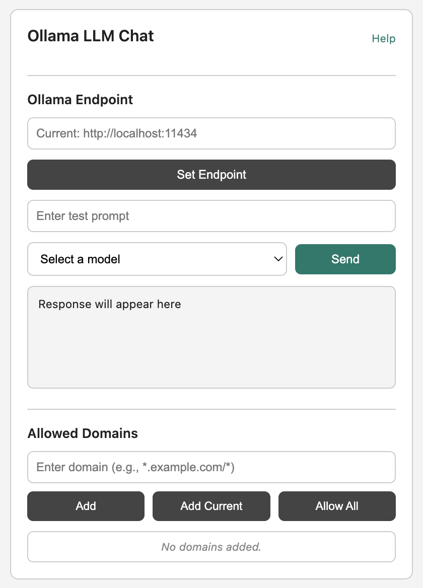

# Ollama Web Extension


## 📥 Install from Browser Stores

**You can now directly install the extension from the official browser stores:**

[](https://chromewebstore.google.com/detail/ollama-universal-extensio/lcikklkphhplagphmoamknnemokhpeom)
[](https://addons.mozilla.org/en-US/firefox/addon/ollama-web-extension/)

A secure web extension that acts as a local proxy for [Ollama](https://ollama.com/) instance. It allows web applications to communicate with local language models without exposing the Ollama API to the internet.

This project uses a modern Webpack build system and a unified manifest to automatically generate compatible packages for **Chrome** (Manifest V3) and **Firefox** (Manifest V2).



## ✨ Features

* **Cross-Browser Support** : Single codebase for Chrome and Firefox.
* **Configurable Ollama Endpoint** : Change the API URL in the popup UI.
* **Interactive Popup** : Fetch models and send test prompts directly.
* **Secure Web App Integration** : Domain-based allow-list for authorized web applications.
* **Injected `window.ollama` API** : Provides a clean, developer-friendly API directly in your web app, no extension ID required.

---

## 🔌 Prerequisites: Setting Up Ollama

Before using the extension, ensure Ollama server is running locally and configured.

### 1. Install Ollama

Download from the [official website](https://ollama.com/download).

* **macOS** : Download and drag to Applications.
* **Windows** : Download and run the `.exe` installer.
* **Linux** :

```shell
  curl -fsSL https://ollama.com/install.sh | sh
```

Verify by running a model:

```shell
ollama run llama3
```

### 2. Configure Ollama CORS

Ollama blocks website/extension requests for security. Set an environment variable to allow development.

#### For Chrome Development:

Allows any Chrome extension to connect.

```bash
OLLAMA_ORIGINS="chrome-extension://*" ollama serve
```

#### For Firefox Development:

Allows a web app to communicate via the extension.

```bash
OLLAMA_ORIGINS="moz-extension://fac69d44-10a3-4111-8921-fbcf0b99d5c9" ollama serve

```

For Both Chrome & Firefox: Use a comma-separated list.

```bash
OLLAMA_ORIGINS="chrome-extension://*,moz-extension://fac69d44-10a3-4111-8921-fbcf0b99d5c9" ollama serve
```

Or, to simplify setup, you can allow all origins — **note that this is not secure, as it permits anyone on your network to access your Ollama instance.**

* **macOS/Linux (bash)** :
  ```
  OLLAMA_ORIGINS="*" ollama serve 
  ```
* **Windows (Command Prompt)** :
  ```
  cmd set OLLAMA_ORIGINS=* && ollama serve
  ```

**Keep the terminal open during development.**

---

## 📦 Installation from Source

Clone the repository:

```bash
git clone https://github.com/ashu01304/Ollama_Web.git
cd Ollama_Web
```

Install dependencies:

```bash
yarn install
```

Build the extension:

* For Chrome: `yarn build:chrome`
* For Firefox: `yarn build:firefox`

This creates a `dist/chrome` or `dist/firefox` folder.

### Load the Extension

* **Chrome** :

1. Go to `chrome://extensions`.
2. Enable "Developer mode".
3. Click "Load unpacked" and select the `dist/chrome` folder.

* **Firefox** :

1. Go to `about:debugging#/runtime/this-firefox`.
2. Click "Load Temporary Add-on...".
3. Select any file inside the `dist/firefox` folder (e.g., `manifest.json`).

## 🚀 Usage

### For Direct Use (Popup UI)

Click the extension icon in your browser to:

* Verify or change the Ollama API endpoint.
* List your downloaded models.
* Send test prompts to a model.
* Manage which websites are allowed to access the API.

### For Web App Developers

The extension enables secure interaction by injecting a `window.ollama` object into the pages of allowed domains.

1. **Authorize Your Web App**: Open the extension popup and add your app’s origin (e.g., `http://localhost:3000/*`) to the "Allowed Domains" list.
2. **Communicate from Your Web App**: Once authorized, use the `window.ollama` object, which provides three main functions:
   * `getModels()`: A simple helper to list available local models.
   * `generate()`: A helper to get a single, non-streamed response from a model.
   * `request()`: A powerful, low-level function to interact with any Ollama API endpoint, giving you full control.

#### Example 1: Fetching available models with `getModels()`

```javascript
// Check if the API is available before using it.
if (window.ollama) {
  async function getModels() {
    try {
      const response = await window.ollama.getModels();
      if (response.success) {
        console.log("Available models:", response.data.models);
      } else {
        console.error("Error fetching models:", response.error);
      }
    } catch (e) {
      console.error("Failed to communicate with the extension:", e);
    }
  }

  getModels();
} else {
  console.error("Ollama extension API not found. Ensure the extension is installed and this domain is allowed.");
}
```

#### Example 2: Generating a response with `generate()`

```javascript
if (window.ollama) {
  async function generateResponse() {
    const params = {
      model: "llama3", // The model to use
      prompt: "Why is the sky blue?",
      stream: false,   // Ensure streaming is off for a single response
    };

    try {
      const response = await window.ollama.generate(params);
      if (response.success) {
        console.log("AI Response:", response.data.response);
      } else {
        console.error("Error generating response:", response.error);
      }
    } catch (e) {
      console.error("Failed to communicate with the extension:", e);
    }
  }
  generateResponse();
}
```

#### Example 3: Advanced usage with `request()`

The `request` function allows you to call any endpoint in the [Ollama API Documentation](https://github.com/ollama/ollama/blob/main/docs/api.md). This is useful for tasks not covered by the helpers, like pulling new models, creating custom models, or managing embeddings.

Here's how to pull a new model:

```javascript
if (window.ollama) {
  async function pullModel() {
    const params = {
      name: "mistral", // The model to pull
      stream: false,
    };

    try {
      // Use the generic 'request' method for full API access
      const response = await window.ollama.request('/api/pull', {
        method: 'POST',
        body: JSON.stringify(params)
      });

      if (response.success) {
        console.log("Successfully started pulling model:", response.data);
      } else {
        console.error("Error pulling model:", response.error);
      }
    } catch (e) {
      console.error("Failed to communicate with the extension:", e);
    }
  }

  pullModel();
}
```

## 🛠️ Development Workflow

1. Install dependencies:

   ```bash
   yarn install
   ```
2. Run development server (rebuilds on file change):

   ```bash
   # For Chrome
   yarn dev:chrome

   # For Firefox
   yarn dev:firefox
   ```
3. Create a production build:

   ```bash
   # For Chrome
   yarn build:chrome

   # For Firefox
   yarn build:firefox
   ```

This creates an optimized `.zip` (Chrome) or `.xpi` (Firefox) in the `dist/` directory.

## 🛠️ Technology Stack

* **TypeScript** : Robust, maintainable code.
* **Webpack** : Professional extension bundling.
* **React** : Popup UI.
* **webextension-polyfill** : Cross-browser extension APIs.

## 📜 License

MIT License.

```

```
