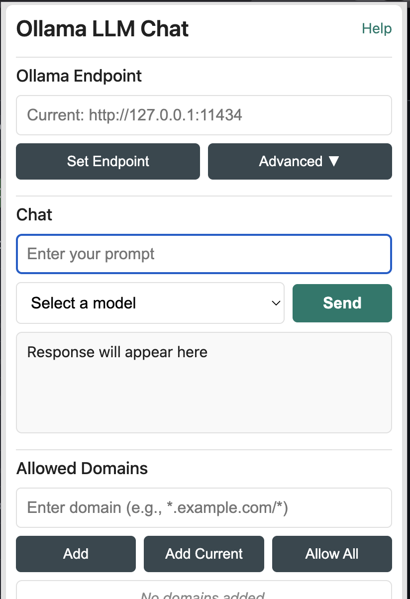

# Ollama Web Extension


A secure web extension that acts as a local proxy for [Ollama](https://ollama.com/) instance. It allows web applications to communicate with local language models without exposing the Ollama API to the internet.

This project uses a modern Webpack build system and a unified manifest to automatically generate compatible packages for **Chrome** (Manifest V3) and **Firefox** (Manifest V2).



## ✨ Features

* **Cross-Browser Support** : Single codebase for Chrome and Firefox.
* **Configurable Ollama Endpoint** : Change the URL in popup UI.
* **Interactive Popup** : Fetch models and send test prompts.
* **Secure Web App Integration** : Domain-based allow-list for authorized web applications.
* **Developer-Friendly Proxy** : Forwards requests to valid Ollama API endpoints (e.g., `/api/generate`, `/api/chat`, `/api/tags`).

---

## 🔌 Prerequisites: Setting Up Ollama

Before using the extension, ensure Ollama server is running locally and configured.

### 2. Configure Ollama CORS (For Development)

### 1. Install Ollama

[](https://github.com/ashu01304/Ollama_Web/edit/main/README.md#1-install-ollama)

Download from the [official website](https://ollama.com/download).

* **macOS** : Download and drag to Applications.
* **Windows** : Download and run the `.exe` installer.
* **Linux** :

```shell
  curl -fsSL https://ollama.com/install.sh | sh
```

Verify by running a model:

```shell
ollama run llama3
```

### 2. Configure Ollama CORS

Ollama blocks website/extension requests for security. Set an environment variable to allow development.

#### For Chrome Development:

Allows any Chrome extension to connect.

```bash
OLLAMA_ORIGINS="chrome-extension://*" ollama serve
```

#### For Firefox Development:

Allows a web app to communicate via the extension.

```bash
OLLAMA_ORIGINS="moz-extension://fac69d44-10a3-4111-8921-fbcf0b99d5c9" ollama serve

```

For Both Chrome & Firefox: Use a comma-separated list.

```bash
OLLAMA_ORIGINS="chrome-extension://*,moz-extension://fac69d44-10a3-4111-8921-fbcf0b99d5c9" ollama serve
```

Or, to simplify setup, you can allow all origins — **note that this is not secure, as it permits anyone on your network to access your Ollama instance.**

* **macOS/Linux (bash)** :
  ```
  OLLAMA_ORIGINS="*" ollama serve 
  ```
* **Windows (Command Prompt)** :
  ```
  cmd set OLLAMA_ORIGINS=* && ollama serve
  ```

**Keep the terminal open during development.**

---

## 📦 Installation from Source

Clone the repository:

```bash
git clone https://github.com/dashu0134/Ollama-Web.git
cd Ollama-Web/ollama-webpack-extension
```

Install dependencies:

```bash
yarn install
```

Build the extension:

* For Chrome: `yarn build:chrome`
* For Firefox: `yarn build:firefox`

This creates a `dist/chrome` or `dist/firefox` folder with the installable extension.

Load the extension:

#### Chrome:

1. Go to `chrome://extensions`.
2. Enable "Developer mode".
3. Click "Load unpacked" and select `dist/chrome`.

#### Firefox:

1. Go to `about:debugging#/runtime/this-firefox`.
2. Click "Load Temporary Add-on...".
3. Select any file in `dist/firefox` (e.g., `manifest.json`).

---

## 🚀 Usage

### For Direct Use (Popup UI)

Click the extension icon to:

* Verify/change Ollama API endpoint.
* List downloaded models.
* Send test prompts.
* Manage allowed websites.

 **Note for Chrome Developers** : Replace `YOUR_CHROME_EXTENSION_ID_HERE` with your extension’s ID from `chrome://extensions`.

### For Web App Developers

The extension enables secure interaction with a local Ollama instance.

1. **Authorize Your Web App**: Add your app’s origin (e.g., `http://localhost:3000/*`) to the "Allowed Domains" in the popup.
2. **Communicate from Your Web App**: The extension securely injects a `window.ollama` object into the page. Use this to send requests:

```javascript
// The extension injects an `ollama` object into the window of allowed domains.
// Check if the API is available before using it.
if (window.ollama) {
  // Example: Fetching models
  async function getModels() {
    try {
      const response = await window.ollama.request(
        '/api/tags',
        { method: 'GET' }
      );

      if (response.success) {
        console.log("Available models:", response.data.models);
      } else {
        console.error("Error:", response.error);
      }
    } catch (e) {
      console.error("Failed to communicate with the extension:", e);
    }
  }

  // Call the function
  getModels();
} else {
  console.error("Ollama extension API not found. Ensure the extension is installed and this domain is allowed.");
}
```


---

## 🛠️ Development Workflow

Install dependencies:

```bash
yarn install
```

Run development server:

* For Chrome:

```bash
yarn dev:chrome
```

* For Firefox:

```bash
yarn dev:firefox
```

Webpack runs in "watch mode", rebuilding on file changes. Reload the extension in the browser to see updates.

Create a production build:

```bash
yarn build:chrome
# or
yarn build:firefox
```

This creates an optimized `.zip` (Chrome) or `.xpi` (Firefox) in `dist/`.

---

## 🛠️ Technology Stack

* **TypeScript** : Robust, maintainable code.
* **Webpack** : Professional extension bundler.
* **React** : Popup UI.
* **webextension-polyfill** : Cross-browser extension APIs.

---

## 📄 License

MIT License.
